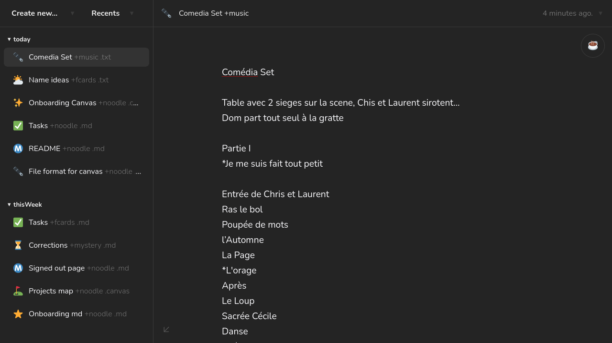
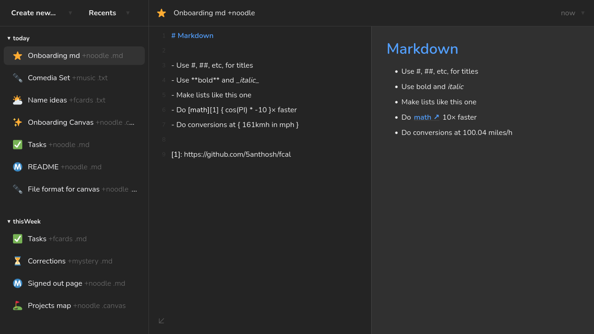
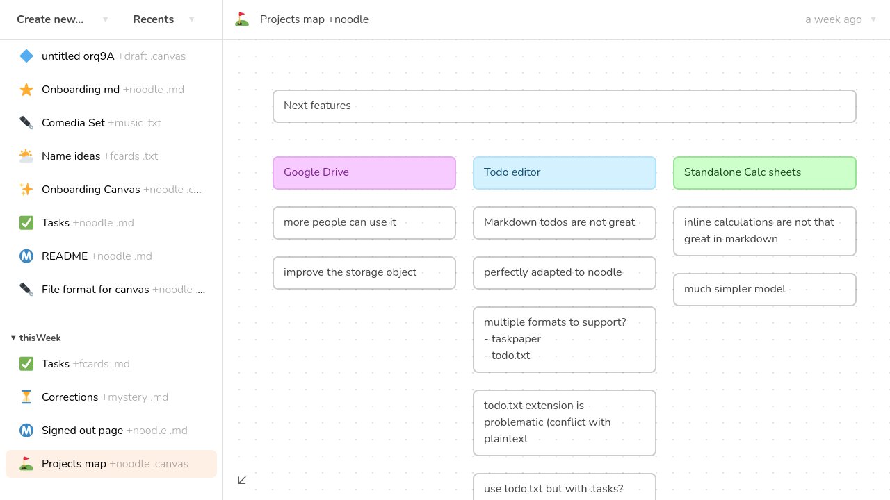

# 🍜
**noodle.page**

a collection of text-based thinking tools  
a place to noodle on your own.

Use it at <https://noodle.page>

noodle offers a simple environement to edit and manage various type of plaintext files.

Draft notes, emails, make quick calculation sheets, sketch some diagrams.

noodle can run entirely locally, using the browser localStorage, which makes it very private.
noodle can also sync with dropbox, with very minimal permissions (basically access to one special folder, empty by default) 

## a plain text editor
noodle is a very simple editor of .txt files, with the ability to turn on some background noise if you need to concentrate. Perfect to draft this email or braindump.



## a markdown editor
noodle supports markdown files.


## a simple box / freeform canvas
Sometimes you need to be able to move bits of text around to think. sort ideas, create hierachies, etc.

noodle support a very simple format to store and render boxes. the format is just a JSON objects
> TODO: change the format

```json
[{
    "content": "plaintext content of the box",
    "left": 144,
    "top": 144,
    "width": 264,
    "height": 216,
    "decoration": 5
}]
```

Some tips to use the canvas:
- Click anywhere on the grid and drag to create boxes
- When a box is selected, hold the control key and scroll to switch between styles.
- Right click on a box to send it to the back
- Left click on a box to bring it to the front
- The canvas are hardcoded at 8000px high for now 



## roadmap
I would like to add some more things to noodle:
- a dedicated calc sheet, a la soulver
- a dedicated todo files support. I have to decide between todo.txt or taskpaper
- a way to download / restore a backup, especially for localstorage users
- google drive support
- better mobile support
- a more powerful canvas, with link previews, iframes, etc
- PWA support

## web 1.0
noodle is just an html file, some stylesheets, and some javascript files. it doesn't have a server app. its code *is* it's source code. as a matter of fact, a goal for this project is to keep the code accessible and easy to read and understand.

## dropbox sync
You can sync your notes using your Dropbox if you want. It will create the folder **Dropbox / Apps / noodle.page**.

The permissions are as limited as possible. noodle can **only** access the **Dropbox / Apps / noodle.page** folder.

You can [register your own Dropbox app](https://developers.dropbox.com/) and change the value of `this.dbClientID` in main.js on line 5, if you prefer.

## how to run
locally, just launch an http server like the python's one:
```bash
python -m http.server
```
and then visit http://localhost:8080/ in your browser.
